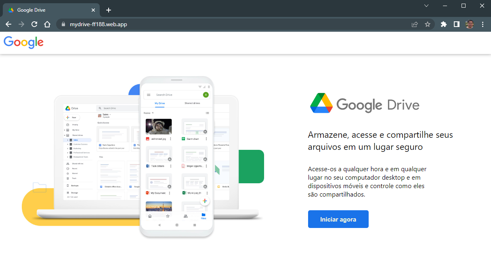
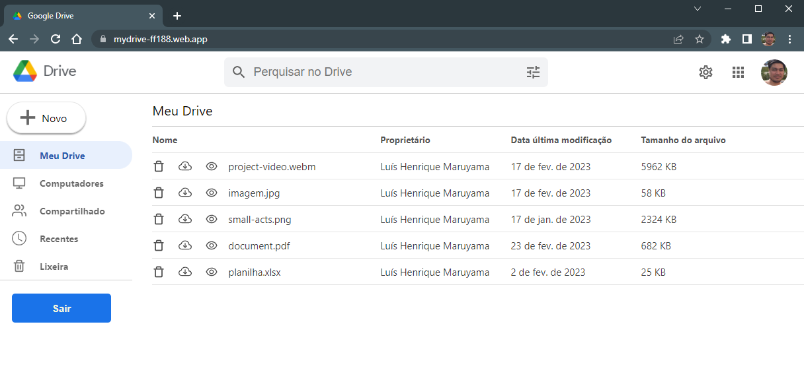

## Sobre o projeto
- Trata-se de um site clone do google drive desenvolvido com React, Javascript e o Firebase da Google.

## Recursos
- Registro e Autenticação de usuários pelo popup do Google
- Upload, View, Download e Delete de arquivos

## Deploy

 
Tela de login
 
 

 
Tela do usuário
 
 

## Objetivo
- Praticar o desenvolvimento do front end e back end de uma aplicação web.
- Praticar requisições, criação e manipulação de banco de dados.
- Praticar as tecnologias: React e Firebase do Google (Authetication, Firestore, Storage e Hosting)

## Roteiro
- criação do projeto no firebase (Authentication, Storage e Firestore)
- configuração e conexão do firebase com app react 
- login/autenticação de usuários pelo popup do Google (useState())
- persistencia de login (useEffect())
- front end e style
- recursos de upload e delete de arquivos
- regras de segurança no firebase

## Instalações
- `npx create-react-app clone-googledrive`
- `npm i react-router-dom`
- `npm i firebase@9.17.1`
- `npm i react-icons --save`
- `npm install --save react-download-link`
- `npm install -g firebase-tools`
- `firebase login` no cmd
- `npm run build` no cmd
- `firebase init hosting` no cmd
- ? What do you want to use as your public directory? build
- ? Configure as a single-page app (rewrite all urls to /index.html)? Yes
- ? Set up automatic builds and deploys with GitHub? No
- ? File build/index.html already exists. Overwrite? No
- `firebase deploy --only hosting` no cmd

## Documentação do Firebase
- https://firebase.google.com/docs/

## Tecnologias
- O projeto foi desenvolvido usando apenas HTML, CSS, JAVASCRIPT, REACT e FIREBASE.

## Sobre o Authentication
- O objetivo do Firebase Authentication é facilitar o desenvolvimento de um sistema de autenticação seguro. Ele oferece uma solução de identidade completa, compatível com contas de e-mail/senha, autenticação por telefone, login do Google, Twitter, Facebook, GitHub e outros.

## Sobre Cloud Firestore
- O Cloud Firestore é um banco de dados de documentos NoSQL que permite armazenar, sincronizar e consultar dados facilmente para seus apps para dispositivos móveis e da Web, em escala global e em tempo real.

## Sobre o Cloud Storage
O Cloud Storage para Firebase é um serviço de armazenamento de objetos avançado, simples e econômico criado para a escala do Google. Com os SDKs do Firebase para Cloud Storage, é possível usar a segurança do Google para fazer upload e download de arquivos nos apps do Firebase, independentemente da qualidade da rede.

## Sobre o Hosting
O Firebase Hosting é um recurso de hospedagem de conteúdo da Web de nível de produção para desenvolvedores. Com um único comando, é possível implantar apps da Web rapidamente e exibir conteúdo estático e dinâmico a uma rede de distribuição de conteúdo (CDN) global.

